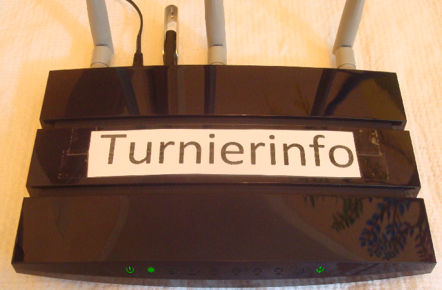
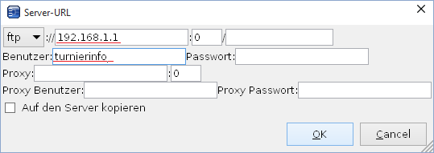

# Turnierinfo Bedienungsanleitung

Turnierinfo ist ein Wlan Router optimiert für die Nutzung bei Judo Turnieren in Kombination mit der Turnierorganisationssoftware JudoShiai. Turnierinfo enthält ein integriertes Besucherinformationssystem.

Der Router stellt zwei getrennte Netzwerke zur Verfügung; eins für die IT Infrastruktur der Turnier Organisation und ein zweites zur Information der Besucher. Der Inhalt der Besucherinformationsseite kann automatisch von JudoShiai aktualisiert werden.

## Aufbau

Verbinden Sie den Router über das Netzteil mit der Stromversorgung. Wenn die Status LED nicht mehr blinkt ist der Router voll funktionsfähig. Beachten Sie, dass der Router zusätzlich einen Ein/Aus Schalter hat, den man betätigen kann wenn er nicht automatisch startet sobald er Strom hat.

## Verbindung Herstellen

### Besucher WLAN

Um sich mit dem öffentlichen Netzwerk für Besucher zu verbinden kann man einfach dem unver­schlüs­selten WLAN mit dem Namen (SSID) 'turnierinfo' beitreten. Normalerweise wird man sofort automatisch auf die Website mit allen relevanten Informationen zum Turnier weitergeleitet.

### Turnierorganisations Netzwerk

Die Rechner an den Kampfrichtertischen können entweder per Ethernet Kabel oder per WLAN mit Turnierinfo verbunden werden. Das WLAN für die Turnierorganisation ist normalerweise unsichtbar für Endgeräte. Um sich per WLAN mit Turnierinfo zu verbinden muss man explizit eine neue WLAN Verbindung anlegen. In Windows geht das zum Beispiel über die Systemsteuerung. Navigieren sie zu: "Systemsteuerung"->"Netzwerk und Internet"->"Netzwerk- und Freigabecenter"->"Neue Verbindung oder neues Netzwerk einrichten". Die SSID und das Passwort finden Sie im Anhang "Zugänge und Passwörter".

## JudoShiai Konfigurieren

Verbinden sie den Rechner auf dem JudoShiai läuft mit dem Router (s. vorheriges Kapitel) und gehen Sie nun in Judoshiai zu dem Menüpunkt "Ergebnisse"->"Alle drucken (Web und PDF)". Es erscheint ein Dateiauswahldialog, in dem Sie irgendeinen lokalen Ordner auswählen, in dem JudoShiai die Dateien für die Turnierinfowebsite temporär ablegen kann. Achten sie darauf, dass die Häckchen bei "Statistik erzeugen" und "Automatische Webseitenaktualisierung" wie im folgenden Bild zu sehen gesetzt sind.

Nun wählen Sie den Menüpunkt "Ergebnisse"->"Auf den Server kopieren" und erhalten den ServerURL Dialog. Füllen sie den Dialog wie in in der folgenden Abbildung gezeigt aus.

JudoShiai sollte nun automatisch anfangen regelmäßig aktuelle Informationen auf dem Turnierinfo Server bereitzustellen. Sie können dies testen, indem Sie ihr Smartphone mit dem Besucher WLAN verbinden und überprüfen ob die Informationen auf der Website aktuell sind. Wenn Sie in JudoShiai ein Kampfergebniss eintragen, sollte dies 30 Sekunden später auf der öffentlichen Website sichtbar sein.
